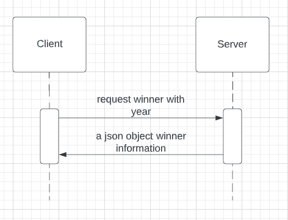
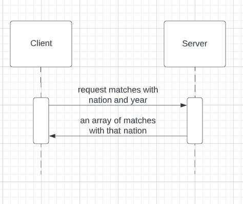

# World Cup Server

This is a server for the CS361 microservice project. It is a simple server that uses a RESTful API. It is written in Node.js and uses Express.js as a framework.

# Getting Started

-   Clone the repository
-   Install Node.js 18.0.0 or higher
-   Install the dependencies with `npm install`
-   Build the project with `npm run build`
-   Run the server with `npm start`
-   The server will be running on port 50555

# API

## Get Winner Endpoint

Request: GET localhost:50555/get-winner?year=2018
Response:

```json
{
    "key_id": 22,
    "tournament_id": "WC-2022",
    "tournament_name": "2022 FIFA World Cup",
    "year": 2022,
    "start_date": "2022-11-20",
    "end_date": "2022-12-18",
    "host_country": "Qatar",
    "winner": "Argentina",
    "host_won": 0,
    "count_teams": 32,
    "group_stage": 1,
    "second_group_stage": 0,
    "final_round": 0,
    "round_of_16": 1,
    "quarter_finals": 1,
    "semi_finals": 1,
    "third_place_match": 1,
    "final": 1
}
```



## Get Matches Endpoint

Request: GET localhost:50555/get-matches?year=2018&nation=France
Response:

```json
[
  {
    "key_id": 908,
    "tournament_id": "WC-2022",
    "tournament_name": "2022 FIFA World Cup",
    "match_id": "M-2022-08",
    "match_name": "France v Australia",
    "stage_name": "group stage",
    "group_name": "Group D",
    "group_stage": 1,
    "knockout_stage": 0,
    "replayed": 0,
    "replay": 0,
    "match_date": "2022-11-22",
    "match_time": "22:00",
    "stadium_id": "S-111",
    "stadium_name": "Al Janoub Stadium",
    "city_name": "Al Wakrah",
    "country_name": "Qatar",
    "home_team_id": "T-28",
    "home_team_name": "France",
    "home_team_code": "FRA",
    "away_team_id": "T-04",
    "away_team_name": "Australia",
    "away_team_code": "AUS",
    "score": "4–1",
    "home_team_score": 4,
    "away_team_score": 1,
    "home_team_score_margin": 3,
    "away_team_score_margin": -3,
    "extra_time": 0,
    "penalty_shootout": 0,
    "score_penalties": "0-0",
    "home_team_score_penalties": 0,
    "away_team_score_penalties": 0,
    "result": "home team win",
    "home_team_win": 1,
    "away_team_win": 0,
    "draw": 0
  },
  ...
]
```



## Notes

-   If you provide an invalid year, the server will return a 400 error with a list of valid world cup years.
-   If you provide an invalid nation, the server will return a 400 error with a list of valid nations.
